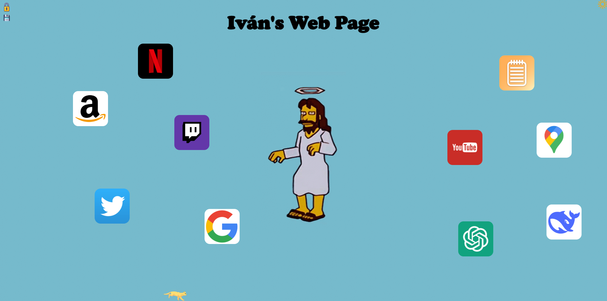

# El rincón de Iván

Bienvenido/a a **El rincón de Iván**, una página web personal hecha en HTML, CSS y JavaScript puro, donde puedes añadir imágenes con enlaces, tomar notas rápidas y consultar el tiempo.

## ✨ Características

- **Notas rápidas:** Guarda y edita notas que se almacenan en tu navegador.
- **Añadir enlaces personalizados:** Agrega imágenes con enlaces y posiciónalas donde quieras en la pantalla.
- **Widget del tiempo:** Consulta el clima actual en A Coruña con un clic.
- **Interfaz interactiva y personalizable:** Arrastra elementos, bloquea/desbloquea la edición y elimina lo que quieras.
- **Persistencia local:** Todo se guarda en `localStorage`, sin base de datos externa.

---

## 🚀 Instalación y uso

1. **Descarga o clona este repositorio:**

   ```bash
   git clone https://github.com/Skarzena/el-rincon-de-ivan.git
   cd el-rincon-de-ivan
   ```

2. **Estructura de carpetas:**

   ```text
   ├── index.html
   ├── tiempo.html
   ├── script.js
   ├── styles.css
   ├── images/
   │   ├── icon.png
   │   ├── jesus.gif
   │   ├── sol.png
   │   ├── notas.png
   │   ├── cat.webp
   │   ├── lock.png
   │   ├── unlock.png
   |   ├── save.png
   |   └── vista_previa.png
   └── README.md
   ```

3. **Abre `index.html` en tu navegador.**  
   No se necesitan dependencias ni servidor. Solo un navegador.

---

## 🧩 Cómo funciona

- Haz clic en el icono de candado 🔒 para desbloquear la edición y movilidad de los elementos.
- Usa el botón **+** para añadir una nueva URL con su imagen.
- Usa el botón **-** para eliminar elementos añadidos.
- Haz clic en la imagen de notas para escribir o guardar tus notas.
- Haz clic en el sol 🌞 para ver u ocultar el widget del tiempo en A Coruña.

---

## 🖼️ Capturas

<details>
    <summary>Ejemplo de pantalla de inicio con esta web:</summary>

   

</details>

---

## 📝 Autor

Desarrollado por `Iván Escarcena López`.

---

## ⚖️ Licencia

Este proyecto es de uso personal. Puedes modificarlo libremente.  
Si lo publicas, por favor acredita al autor original.